# OPPO / 一加 (OnePlus) 云便签全量导出工具 (ColorOS Notes Exporter)

<p align="center">
  
  
  
  
  
</p>

<p align="center">
  <b>一键将 OPPO / 一加 (OnePlus / ColorOS 随身工作台) 中的全部便签导出为 Markdown、CSV 与 JSON。</b><br>
  专为换机备份、知识库迁移（Obsidian / Notion / Logseq）与本地离线归档打造。
</p>

<p align="center">
  <a href="README.md">简体中文</a> • <a href="README_EN.md">English Documentation</a>
</p>

---

## 🎬 终端运行动效预览



---

## 💡 为什么做这个项目？(项目诞生背景)

很多深度使用手机便签的用户，习惯在上面记录灵感、日常待办、考试备考、重要备忘与心路历程。

当笔者希望**对过去几年的生活与思考做一个全面回顾，并尝试将这些真实的个人笔记喂给大语言模型（LLM）构建专属于自己的“数字分身”（AI Agent / 个人画像）**时，遇到了阻碍：

1. **官方无批量导出入口**：OPPO 云服务（ColorOS 随身工作台）虽然提供了跨设备云同步，但官方**没有提供“一键导出全部笔记”的功能**。面对账号里积攒的几百篇长笔记，人工逐篇复制粘贴极其耗时耗力。
2. **传输层加密限制**：网页端接口对笔记数据采用了动态 AES 加密与防重放签名，普通抓包或简单脚本无法直接获取解密后的明文数据。

因此我制作了这款自动化导出工具，帮助自己将 400+ 篇便签完整无截断地导出出来，顺利用于个人大模型智能体的知识库沉淀与画像构建。将其整理开源，**希望能帮助到同样需要将便签全部导出、用于个人归档或大模型探索的朋友。**

---

## 🌟 核心特性与技术亮点

- 🛡️ **免逆向破解，穿透传输层加密**：
  OPPO 云笔记传输层采用 AES-CBC 动态加解密并附加时间戳签名防重放。传统爬虫极难维护且随时失效。本项目通过 **Chrome DevTools Protocol (CDP)** 挂钩宿主浏览器运行时上下文，直接捕获已解密明文，稳健可靠。
- 📖 **全文深度抓取，杜绝截断**：
  突破列表接口仅返回前几十字预览片段的限制，驱动真实虚拟滚轮懒加载，并自动逐篇激活详情节点获取 100% 完整长正文。
- 📝 **结构化排版与复选框还原**：
  - 完整保留换行、多级段落与空格缩进。
  - 将原生待办列表精准映射为标准 Markdown 复选框语法（`☑` 已完成 / `☐` 未完成）。
- 📦 **开箱即用的多格式导出**：
  - `notes.json`：包含版本号、附件统计、原始 HTML 的全量元数据。
  - `notes.csv`：内嵌 **UTF-8 BOM 头**，Microsoft Excel 双击直开绝无中文乱码。
  - `notes.md`：按更新时间倒序汇总的单文件 Markdown。
  - `markdown/`：独立 Markdown 知识库，每篇含 YAML Frontmatter（标题、时间、分组），**直接复制到 Obsidian 仓库即用**。
- 🔒 **纯本地只读与安全免密**：
  无需在任何脚本中输入账号密码，通过只读隔离沙箱运行，数据流全程保留在你的本机。

---

## 🚀 快速上手 (Quick Start)

### 环境要求
- [Node.js](https://nodejs.org/) (>= 18.0.0)
- 本地已安装 Microsoft Edge 或 Google Chrome 浏览器

### 1. 安装与运行

```bash
# 克隆仓库
git clone https://github.com/xm2284/oppo-notes-exporter.git
cd oppo-notes-exporter

# 安装依赖
npm install

# 启动导出向导
npm start
```

### 2. 交互三步法
1. 终端会自动唤起一个独立的 Edge/Chrome 窗口并导航至 OPPO 云服务；
2. 在窗口中扫码或短信登录你的 OPPO 账号；
3. 看到页面展示出「便签」列表后，**回到终端敲击回车键**，后续全自动完成。

---

## 📂 导出成果文件库结构

运行结束后将在 `./output` 目录下生成：

```text
output/
├── notes.json            # 全量 JSON 数据 (二次开发/数据库导入)
├── notes.csv             # Excel 兼容表格 (UTF-8 with BOM)
├── notes.md              # 汇总版 Markdown 文档
└── markdown/             # 独立 Markdown 文件库 (Obsidian 专属)
    ├── 001_毕业设计选题.md
    ├── 002_常用词汇备忘.md
    └── ...
```

### Obsidian / Logseq 独立文档效果示例

```markdown
---
title: "一定要精确到时间，不要乱"
created: "2026/09/28 14:10:05"
updated: "2026/10/05 21:38:38"
group: "日常规划"
recordId: "20261005xxxx"
---

一定要精确到时间，不要乱
你要知道你要什么，未来是怎么样的

☐ 1. 软著申请
☑ 2. 背单词
☑ 3. 做英语试卷
```

---

## 🏗️ 架构与数据流

```text
+------------------------+          CDP (Port 9222)          +----------------------------+
| 独立调试浏览器 (Edge/Chrome) | <─────────────────────────────────> | oppo-notes-exporter (CLI)  |
+------------------------+                                   +----------------------------+
           │                                                               │
           ▼                                                               ▼
  [OPPO 云服务加密响应]                                            [1. 运行时挂钩 JSON.parse]
           │                                                               │
  [浏览器内部解密模块]                                            [2. 虚拟列表滚轮遍历]
           │                                                               │
  [Vue Component 渲染树]  <─── 逐项模拟激活触发详情 ───────────────────────┤
           │                                                               │
           └────────────── 读取明文 Props / Stash 数据 ────────────────────> [3. 提取完整正文与属性]
                                                                           │
                                                                           ▼
                                                             [4. AST 排版清洗 & 格式化输出]
                                                                           │
                                                      +--------------------+--------------------+
                                                      │                    │                    │
                                                      ▼                    ▼                    ▼
                                                 notes.json            notes.csv            markdown/
```

---

## 🤝 参与贡献

欢迎提交 Issue 与 Pull Request！请查阅 [贡献指南 (CONTRIBUTING.md)](CONTRIBUTING.md)。

---

## ⚠️ 免责声明 (Disclaimer)

1. 本工具仅供个人学习、技术研究及在合法授权下备份自己名下的便签数据使用。
2. 本工具不篡改云端任何数据，不绕过登录鉴权，不收集任何用户隐私数据。
3. 请合理使用，遵守相关云服务提供商的服务协议。

---

## 📄 开源许可证

本项目遵循 [MIT 许可证](LICENSE)。
